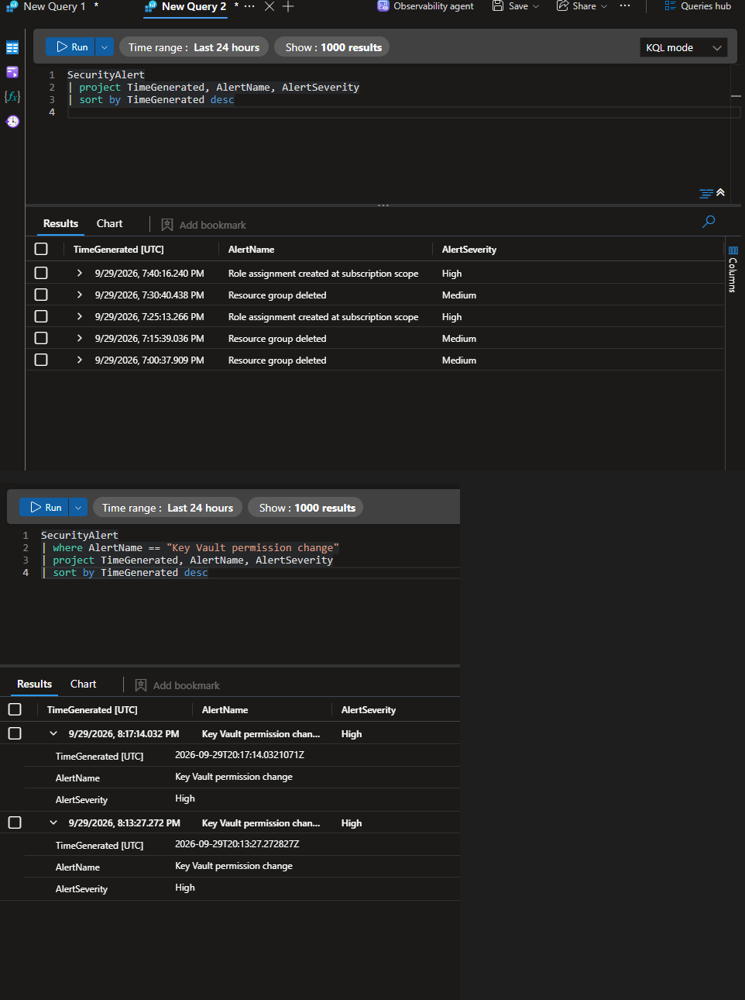
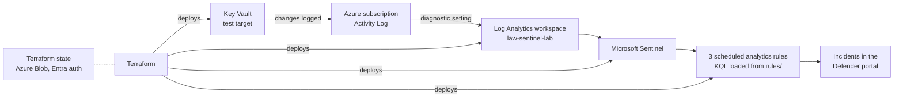
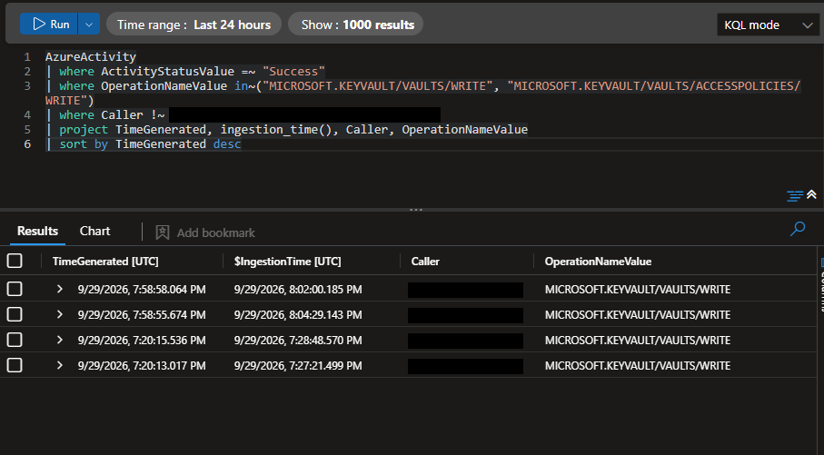
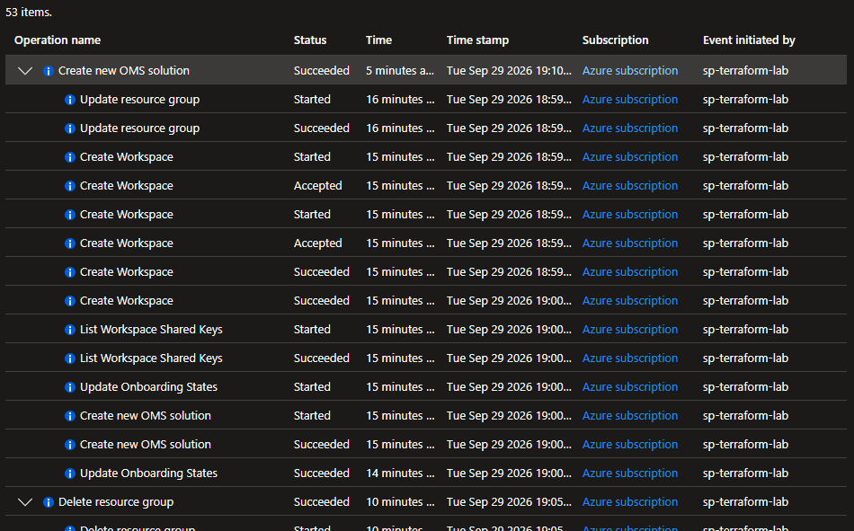
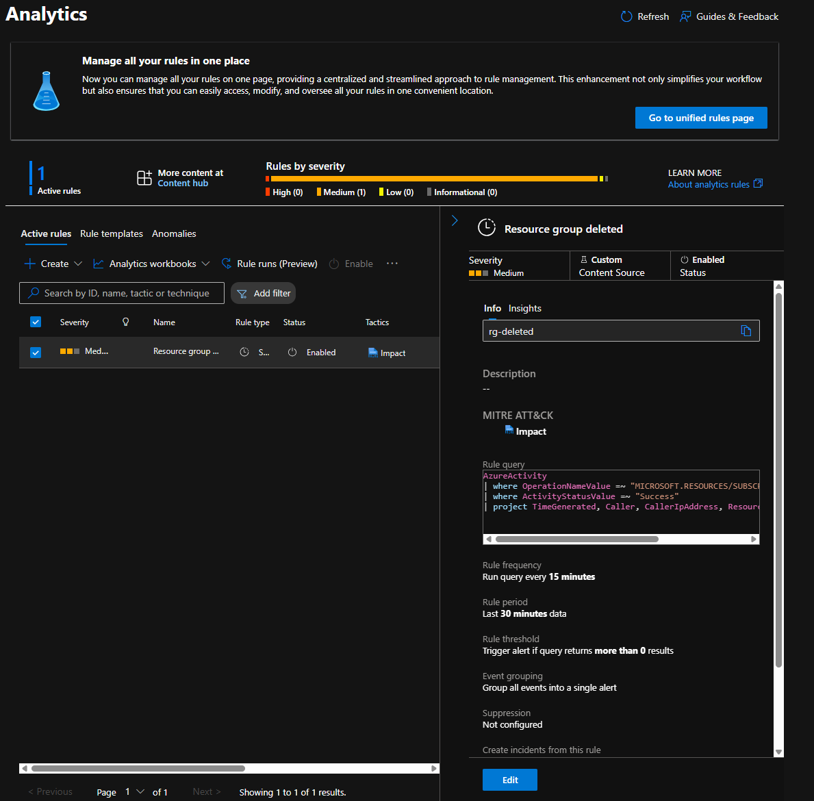
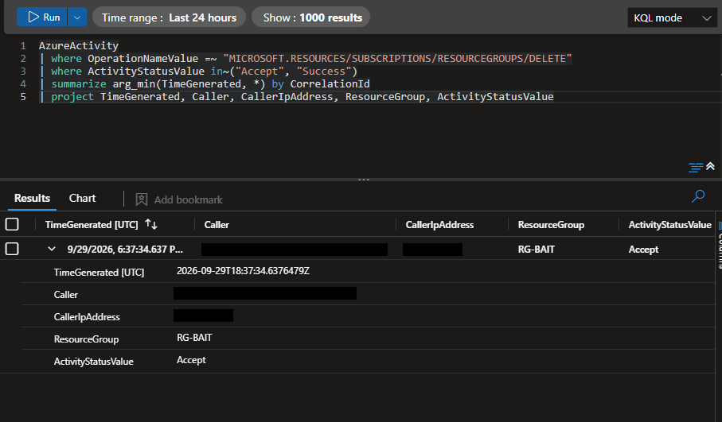
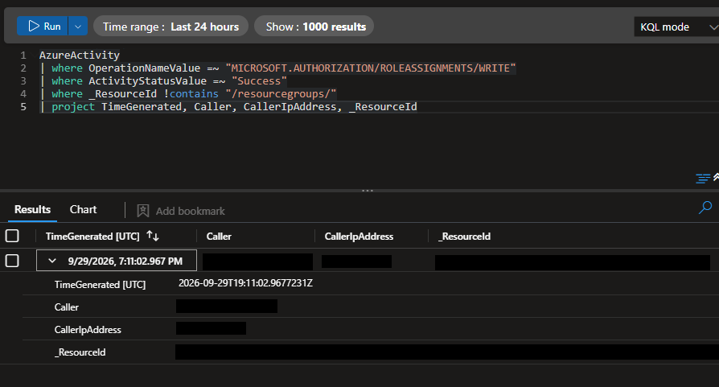
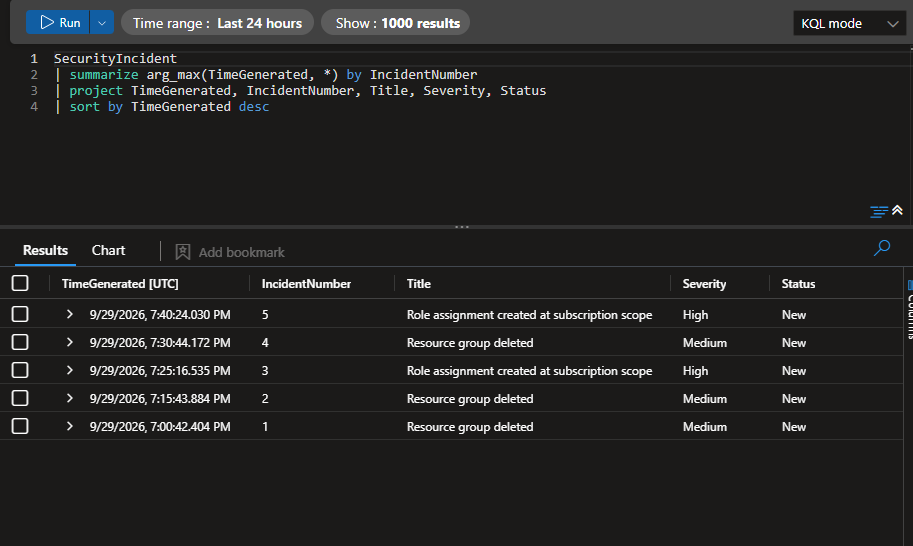

# Sentinel detection lab

I built a small Microsoft Sentinel environment in Azure entirely with Terraform, then wrote three detection rules as code and tested each one by doing the thing it's meant to catch.

My background is vulnerability management and endpoint engineering. I've spent years fixing what scanners find. This project is me working on the other side of that: spotting risky changes as they happen, and doing it in a way that can be rebuilt, reviewed and version-controlled like any other code.

Everything here can be deployed and torn down with one command. Nothing was clicked together in the portal.



## What it builds



- **Log Analytics workspace** with 30-day retention and a 0.5 GB daily cap, so a forgotten lab can't run up a bill.
- **Microsoft Sentinel** switched on over that workspace.
- **A diagnostic setting** that streams the subscription's Activity Log (admin, security and policy events) into the workspace.
- **Three scheduled analytics rules**, deployed through one reusable module, each with its KQL kept in its own file under `rules/`.
- **A Key Vault** that exists purely as something to attack for rule 3.
- **Remote state** in Azure Blob Storage, accessed with Entra ID rather than storage keys.

## The detections

| Rule | Severity | What it catches | MITRE ATT&CK |
|---|---|---|---|
| Resource group deleted | Medium | Anyone deleting a resource group in the subscription | Impact, T1485 Data Destruction |
| Role assignment at subscription scope | High | An RBAC role granted across the whole subscription, ignoring narrower resource-group grants | Privilege Escalation / Persistence, T1098 Account Manipulation |
| Key Vault permission change | High | Changes to a vault made by anyone other than the Terraform identity, plus RBAC grants scoped to a vault | Credential Access / Persistence, T1098 |

Each rule runs every 15 minutes, looks back 30 minutes, and only counts events that arrived in the last 15. The reasons for that are below.

### Adding a detection

The rules all go through one module in `modules/detection-rule`, so a new detection is two small changes rather than another copy-pasted block.

1. Write the query and test it in Logs, then save it as `rules/<rule_key>.kql`.
2. Add an entry to the map in `detections.tf` with the same key:

```hcl
my_new_rule = {
  display_name = "What the analyst sees"
  description  = "What it catches and why. MITRE ATT&CK: ..."
  severity     = "Medium"
  tactics      = ["Persistence"]
}
```

Run `terraform plan` and it should show one rule to add. The module checks the severity is valid before anything reaches Azure, and the key becomes the rule ID (underscores swapped for hyphens).

## What testing taught me

Writing a rule that looks right is easy. Getting it to fire exactly once, for the right event, took more work. These are the things I only found out by triggering each rule and reading the logs.

**Resource group deletes happen in stages.** My first version alerted on `Success`. When I deleted a test resource group, Azure logged `Start` and `Accept` straight away, but the `Success` event either arrived much later or not at all. On the first test it never showed up. A rule waiting for it would have missed a real deletion. I changed it to alert on `Accept` or `Success` and keep one row per operation using `CorrelationId`, so one delete means one alert.

**Key Vault access policy changes aren't logged the way I expected.** I assumed they'd appear as `VAULTS/ACCESSPOLICIES/WRITE`. When I granted and removed a policy, both showed up as a plain `VAULTS/WRITE`. The trouble is that Terraform creating or updating the vault logs the same operation. So the rule now alerts on vault writes by any identity *other than* the Terraform service principal. That makes it broader than I first planned: it catches any change made outside the pipeline, not just permission changes.

**Overlapping windows caused duplicate incidents.** I'd set a 30-minute lookback on a 15-minute schedule on purpose, so late logs wouldn't slip through the gap. The side effect was that most events were caught by two runs in a row. One test delete produced two incidents. The fix was to add `ingestion_time() > ago(15m)`, so each run only picks up events that have arrived since the last one. Late events are still caught, just once.

**Logs arrive late and out of order.** I measured it rather than guessing. In this lab, Activity Log events took between 3 and 8.5 minutes to land in the workspace, and two events a few seconds apart arrived in reverse order. That's the reason for everything in the previous point.



Two smaller things worth knowing if you're investigating these alerts:

- The `Caller` for automation shows up as the service principal's **object ID**, not the app ID or its name. `az ad sp show --id <appId> --query id -o tsv` maps one to the other.
- Actions from Azure Cloud Shell come from a Microsoft data-centre IP, not the user's own. A sensitive change from an Azure IP can mean someone working from inside the cloud with a borrowed session.

## Security choices

- **No secrets in the repo.** Terraform authenticates with environment variables, the state file lives in Blob Storage, and `.gitignore` covers state, plans and `.tfvars`.
- **Entra auth for state.** The backend uses `use_azuread_auth`, so there are no storage account keys anywhere.
- **A dedicated identity for deployment.** Everything is deployed by a service principal rather than my own account, which is why the Activity Log shows it as the initiator of every change.
- **Code over portal.** I edited a rule's description in the portal once, and `terraform plan` immediately flagged it as drift and offered to revert it. Every change since has gone through code.



## Deploying it

### What you need

- An Azure subscription where you can assign roles
- Terraform 1.9 or later and the Azure CLI (I use WSL2 with Ubuntu)
- A service principal with **Contributor** on the subscription

### 1. Create the state storage (once)

Terraform can't store its state in something it hasn't created yet, so this part is manual.

```bash
RG=rg-tfstate; LOC=uksouth; SA=sttfstate$RANDOM
az group create -n $RG -l $LOC
az storage account create -n $SA -g $RG -l $LOC --sku Standard_LRS \
  --min-tls-version TLS1_2 --allow-blob-public-access false
az storage container-rm create --storage-account $SA -g $RG -n tfstate
echo "State account: $SA"
```

Then, as a subscription owner, give the service principal **Storage Blob Data Contributor** on that storage account. A Contributor can't grant roles to itself.

### 2. Set your environment

```bash
export ARM_CLIENT_ID="<appId>"
export ARM_CLIENT_SECRET="<secret>"
export ARM_TENANT_ID="<tenantId>"
export ARM_SUBSCRIPTION_ID="<subscriptionId>"
export TF_VAR_subscription_id="$ARM_SUBSCRIPTION_ID"
export TF_STATE_SA="<state account name>"
```

I keep these in a file outside the repo with `chmod 600`, and load it from `.bashrc`.

### 3. Register the resource providers (once)

```bash
az provider register -n Microsoft.OperationalInsights
az provider register -n Microsoft.SecurityInsights
az provider register -n Microsoft.OperationsManagement
az provider register -n Microsoft.Insights
```

### 4. Deploy

```bash
terraform init -backend-config="storage_account_name=$TF_STATE_SA"
terraform plan -out=tfplan
terraform apply tfplan
```

Sentinel's incidents page now lives in the Defender portal. To see incidents there, connect the workspace under **Settings → Microsoft Sentinel → SIEM workspaces**.

### 5. Test the rules

Give it 20 to 40 minutes after each action for logs to arrive and the rule to run.

```bash
# Rule 1: resource group deleted
az group create -n rg-bait -l uksouth && az group delete -n rg-bait --yes

# Rule 2: role assignment at subscription scope (run as an owner)
az role assignment create --role Reader --assignee <appId> --scope /subscriptions/<subscriptionId>
az role assignment delete --role Reader --assignee <appId> --scope /subscriptions/<subscriptionId>

# Rule 3: Key Vault permission change (run as a user, not the Terraform SP)
KV=$(az keyvault list -g rg-sentinel-lab --query "[0].name" -o tsv)
az keyvault set-policy --name $KV --spn <appId> --secret-permissions get list
az keyvault delete-policy --name $KV --spn <appId>
```

To check the rules fired without the portal:

```kql
SecurityIncident
| summarize arg_max(TimeGenerated, *) by IncidentNumber
| project TimeGenerated, IncidentNumber, Title, Severity, Status
```

### 6. Tear it down

```bash
terraform destroy
```

One thing that caught me out: Sentinel reserves a deleted rule's ID for a while. If you destroy and immediately apply again, the rules fail with a 409 "recently deleted" error while everything else builds. Wait a bit and run `terraform apply` again, and Terraform creates only what's missing.

## Cost

At lab volumes this costs pennies a day. The workspace has a 0.5 GB daily ingestion cap, logs are kept for the free 30 days, and I destroy everything at the end of each session. A budget alert on the subscription is a sensible extra safety net.

## Limitations

- **The Terraform identity is hard-coded in rule 3** as an allow-list. In a real environment that list would live in a Sentinel watchlist so it can change without editing the rule.
- **Activity Log only.** There's no sign-in data, Defender telemetry or Key Vault data-plane logging (who actually read a secret). That's where I'd go next.
- **No automated response.** Incidents are raised, but nothing acts on them yet. A Logic App playbook would be the natural follow-on.

## Repo layout

```
.
├── providers.tf        Terraform, provider and remote backend settings
├── variables.tf        Inputs (subscription, name prefix)
├── main.tf             Resource group, workspace, Sentinel, Activity Log stream
├── keyvault.tf         Key Vault used as a test target
├── detections.tf       Map of rules, fed into the module with for_each
├── outputs.tf
├── modules/
│   └── detection-rule/ One scheduled analytics rule, with input validation
├── rules/              One KQL file per detection, named after its map key
└── docs/images/        Screenshots
```

## Screenshots

| | |
|---|---|
|  |  |
| Rule as it appears in Sentinel, marked as custom content | The tuned resource group query returning one row per delete |
|  |  |
| The scope filter catching only the subscription-level grant | Incidents created by the rules, before I fixed the duplicates |
